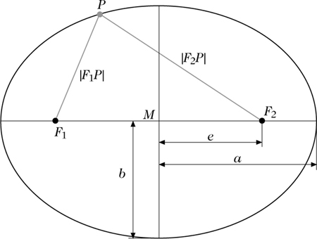

Kepler'sche Gesetze
========================
## Das Erste Kepler'sche Gesetz und Grundlagen zur Ellipse

### Grundlagen zur Ellipse
Eine Ellipse hat zwei Brennpunkte F1 und F2.
Die längste Strecke, die man durch eine Ellipse zeichnen kann nennt man die Hauptachse 2a. Die Nebenachse 2b ist die längste Strecke, die man senkrecht zur Hauptachse ziehen kann. Die Hauptachse ist immer größer als |F1 F2|.

Die Definition einer Ellipse ist die Menge (also der Ort) aller Punkte P, für die gilt: Die Summe von |P F1| und |P F2| ist gleich 2a.

Exzentrizität:
* lineare Exzentrizität "𝑒":
    * ist der Abstand eines Brennpunkts zum Mittelpunkt M (aka Schnittpunkt von 2a und 2b)
    * Wenn 𝑒 = 0, dann ist die Ellipse ein Kreis
* numerische Exzentrizität "ε":
    * ist das Verhältnis der linearen Exzentrizität zur großen Halbachse(a), also 𝑒/a.
    * wenn ε = 0, dann ist die Ellipse ein Kreis.

### Keplers erstes Gesetz
Die Bahnen von Planeten sind Ellipsen und in einem ihrer Brennpunkte befindet sich die Sonne. 

## Das zweite Kepler'sche Gesetz und Konsequenzen für die Jahreszeiten
Die gedachte Linie zwischen dem Planeten und der Sonne deckt pro Zeiteinheit immer die gleiche Fläche ab. Das heißt, der Planet muss sich schneller bewegen, je näher er an die Sonne kommt, weil die Linie kleiner wird.
Für die Jahreszeiten heißt das, dass der Sommer kürzer ist als der Winter, weil der Planet, aufgrund der in Sonnennähe zwangsläufig höheren Geschwindigkeit auch schneller wieder entfernt. 

Quellen: <https://www.spektrum.de/lexikon/mathematik/ellipse/2650>; https://de.wikipedia.org/wiki/Exzentrizit%C3%A4t_(Mathematik) ; https://de.wikipedia.org/wiki/Halbachsen_der_Ellipse ; 