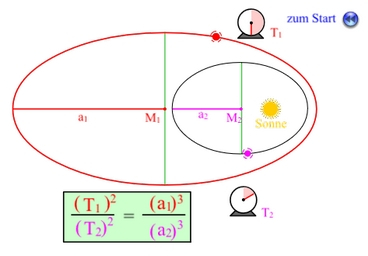
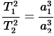
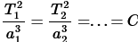

Kepler-Lückentext
========================
Kepler
========================
##  Geschichte

Lebte zu zeit Gesellschaftliches Umbruch hatte 2 Frauen und 11 Kinder
* 29.12.1571 geboren in Weil
* Machte 1588 sein Examen 
* Wurde 1591 Hochschullehrer in Tübingen
* Wurde von Brahe als einen kompetenten & ehrwürdigen Assistenten eingestellt 
* Sein erstes Werk erschien ________ mit dem Titel „_______________ _________________“
    * Enthielt das Grundprinzip des Weltbildes von Kopernikus
* Bekam mit dem Tod von Tycho Brahe all seine Daten über die Bewegung vom Mars was Ihm half bei der Entdeckung seiner Gesetze 
* ________ Veröffentlichung seines Titels „________________ __________“ 
* Durch seine Erkenntnisse kamen viele neue Fragen auf in der Wissenschaft
* 1611 verstarb seine Erste Frau
* 1615 Wurde seine Mutter als Hexe angeklagt, wurde 1621 nach Bemühungen freigesprochen
* 1619 erschien das ___________ ______________ ______________ im Werk: „_________________ _____________“
* Starb am 15.11.1630 in Regensburg auf dem Weg seinen Lohn abzuholen

## Das erste Kepler'sche Gesetz und Grundlagen zur Ellipse
### Grundlagen zur Ellipse
Eine Ellipse hat zwei ____________________ F1 und F2.
Die _______________ 2a ist die längste Strecke, die man durch die Ellipse ziehen kann. Sie ist immer länger als |F1F2|
Die _______________ 2b ist die längste Strecke, die man senkrecht zur Hauptachse ziehen kann.
Der _______________ M der Ellipse ist der Schnittpunkt von Haupt- und Nebenachse.
Die Strecken a und b werden jeweils große und kleine _________________ genannt.
Die Ellipse selbst ist definiert als die Menge aller Punkte P für die gilt:
 

|PF1| + |PF2| = 2a

Exzentrizität:

* _____________ Exzentrizität "𝑒":
    * ist der Abstand von einem Brennpunkt zum Mittelpunkt M
    * Wenn 𝑒 = 0 (beide Brennpunkte liegen auf dem Mittelpunkt), dann ist die Ellipse ein ________.
* _______________ Exzentrizität "ε":
    * ist das Verhältnis 𝑒/a der linearen Exzentrizität und der ____________ Halbachse.
    * Wenn ε = 0, dann ist die Ellipse ein __________

### Das Gesetz
**Die Umlaufbahn jedes Planeten ist eine ____________ und in einem ihrer Brennpunkte befindet sich die ____________.**

## Das zweite Kepler'sche Gesetz und dessen Auswirkungen auf die Jahreszeiten
### Das Gesetz
Die _______________ ____________ zwischen dem Planeten und der Sonne deckt in einem bestimmten Zeitraum immer die gleiche Fläche ab.
Um das zu bewerkstelligen, muss der Planet in der Nähe der Sonne _____________ sein als wenn er weiter weg wäre und als Folge dessen wird der Sommer ____________, weil sich der Planet ____________ wieder von der Sonne entfernt.

## Das dritte Kepler'sche Gesetz
### Definition
Das dritte Kepler‘sche Gesetz vergleicht die _________________ verschiedener Körper **um das gleiche Zentralgestirn**. Körper mit größerer Entfernung zum Zentralgestirn brauchen wesentlich länger für einen Umlauf als Körper mit geringerer Entfernung. So benötigt etwa der ___________________ Planet Merkur nur 88 Tage für einen Umlauf um die Sonne, wohingegen der ___________________ Neptun für einen Umlauf 165 Jahre benötigt.

### Formel
Die ________________ der Umlaufzeiten zweier Planeten um das gleiche Zentralgestirn verhalten sich wie die ______________ der großen Bahn__________________. 

Anders formuliert: Für alle Planeten, die um das gleiche Zentralgestirn kreisen, haben die Quotienten aus dem Quadrat der Umlaufzeit und der dritten Potenz der großen Bahnhalbachse denselben Wert

Die Konstante C, die für jedes Zentralgestirn einen anderen Wert hat, bezeichnet man als  _______________________.

### Anwendungen
Anwendungen davon sind in der Raumfahrt, um die Umlaufbahnen von Satelliten und Raumsonden zu berechnen, sowie in der Astrophysik, um die Bewegungen von Himmelskörpern im All zu verstehen. Es ist eine grundlegende Regel für die Erforschung im Weltraum.

---

Quellen: https://de.wikipedia.org/wiki/Exzentrizit%C3%A4t_(Mathematik) ; https://www.spektrum.de/lexikon/mathematik/ellipse/2650 ; https://www.leifiphysik.de/astronomie/planetensystem/grundwissen/drittes-keplersches-gesetz ; https://www.biologie-schule.de/johannes-kepler.php ; https://www.medienwerkstatt-online.de/lws_wissen/vorlagen/showcard.php?id=15517&edit=0 ; https://upload.wikimedia.org/wikipedia/commons/7/74/JKepler.jpg

Plain-Text-Dokument und Bilder: https://github.com/BadJoKing/Kepler-Gesetze-Handout
