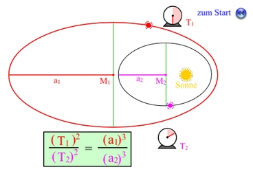
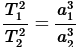
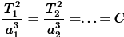

Kepler
========================
##  Geschichte

Lebte zu zeit Gesellschaftliches Umbruch hatte 2 Frauen und 11 Kinder
* 29.12.1571 geb. in Weil
* Machte 1588 sein Examen 
* Wurde 1591 Hochschullehrer in Tübingen
* Wurde von Brahe als einen kompetenten & ehrwürdigen Assistenten eingestellt 
* Sein erstes Werk erschien 1596 mit dem Titel „Mysterium cosmographicum“
    * Enthielt das Grundprinzip des Weltbildes von Kopernikus
* Bekam mit dem Tod von Tycho Brahe all seine Daten über die Bewegung vom Mars was Ihm half bei der Entdeckung seiner Gesetze 
* 1609 Veröffentlichung seines Titels „Astronomia Nova“ 
    * Enthielten die 2 ersten Keplerschen Gesetze
        1. Die Bahnen von Planeten sind Ellipsen. In einem Brennpunkt befindet sich die Sonne
        2. Die gedachte Verbindungslinie Planet-Sonne überstreicht in gleichen Zeitintervallen auch gleiche Flächeninhalte 
* Durch seine Erkenntnisse kamen viele neue Fragen auf in der Wissenschaft
* 1611 verstarb seine Erste Frau
* 1615 Wurde seine Mutter als Hexe angeklagt, wurde 1621 nach Bemühungen Freigesprochen
* 1619 erschien das dritte Keplersche Gesetz im Werk: „Harmonice Mundi“
    * Stellt einen Zusammenhang zwischen der Größe der Ellipse, ausgedrückt durch die Länge a der großen Halbachse, und der Umlaufdauer T eines Himmelskörpers um einen Zentralkörper her.
* Starb am 15.11.1630 in Regensburg auf dem Weg seinen Lohn abzuholen

## Das erste Kepler'sche Gesetz und Grundlagen zur Ellipse
### Grundlagen zur Ellipse
Eine Ellipse hat zwei Brennpunkte F1 und F2.
Die Hauptachse 2a ist die längste Strecke, die man durch die Ellipse ziehen kann. Sie ist immer länger als |F1F2|
Die Nebenachse 2b ist die längste Strecke, die man senkrecht zur Hauptachse ziehen kann.
Der Mittelpunkt M der Ellipse ist der Schnittpunkt von Haupt- und Nebenachse.
Die Strecken a und b werden jeweils große und kleine Halbachsen genannt.
Die Ellipse selbst ist definiert als die Menge aller Punkte P für die gilt:
 

|PF1| + |PF2| = 2a

Exzentrizität:

* lineare Exzentrizität "𝑒":
    * ist der Abstand von einem Brennpunkt zum Mittelpunkt M
    * Wenn 𝑒 = 0 (beide Brennpunkte liegen auf dem Mittelpunkt), dann ist die Ellipse ein Kreis.
* numerische Exzentrizität "ε":
    * ist das Verhältnis 𝑒/a der linearen Exzentrizität und der großen Halbachse.
    * Wenn ε = 0, dann ist die Ellipse ein Kreis

### Das Gesetz
**Die Umlaufbahn jedes Planeten ist eine Ellipse und in einem ihrer Brennpunkte befindet sich die Sonne.**

## Das zweite Kepler'sche Gesetz und dessen Auswirkungen auf die Jahreszeiten
### Das Gesetz
Die gedachte Linie zwischen dem Planeten und der Sonne deckt in einem bestimmten Zeitraum immer die gleiche Fläche ab.
Um das zu bewerkstelligen, muss der Planet in der Nähe der Sonne schneller sein als wenn er weiter weg wäre und als Folge dessen wird der Sommer kürzer, weil sich der Planet schneller wieder von der Sonne entfernt.

## Das dritte Kepler'sche Gesetz
### Definition
Das dritte Kepler‘sche Gesetz vergleicht die Umlaufzeiten verschiedener Körper **um das gleiche Zentralgestirn**. Körper mit größerer Entfernung zum Zentralgestirn brauchen wesentlich länger für einen Umlauf als Körper mit geringerer Entfernung zum Zentralgestirn. So benötigt etwa der sonnennächste Planet Merkur nur 88 Tage für einen Umlauf um die Sonne, wohingegen der sonnenferne Neptun für einen Umlauf 165 Jahre benötigt.

### Formel
Die Quadrate (zweite Potenzen) der Umlaufzeiten zweier Planeten um das gleiche Zentralgestirn verhalten sich wie die Kuben (dritte Potenzen) der großen Bahnhalbachsen 

Anders formuliert: Für alle Planeten, die um das gleiche Zentralgestirn kreisen, haben die Quotienten aus dem Quadrat der Umlaufzeit und der dritten Potenz der großen Bahnhalbachse denselben Wert

Die Konstante C, die für jedes Zentralgestirn einen anderen Wert hat, bezeichnet man als __**Kepler-Konstante.**__

### Anwendungen
Das Gesetz besagt, dass das Verhältnis der Quadrate der Umlaufzeiten zweier Planenten proportional zu den Kuben ihrer mittleren Entfernungen ist. Anwendungen davon sind in der Raumfahrt, um die Umlaufbahnen von Satelliten und Raumsonden zu berechnen, sowie in der Astrophysik, um die Bewegungen von Himmelskörpern im All zu verstehen. Es ist eine grundlegende Regel für die Erforschung im Weltraum.

Quellen: https://de.wikipedia.org/wiki/Exzentrizit%C3%A4t_(Mathematik) ; https://www.spektrum.de/lexikon/mathematik/ellipse/2650 ; https://www.leifiphysik.de/astronomie/planetensystem/grundwissen/drittes-keplersches-gesetz ; https://www.biologie-schule.de/johannes-kepler.php ; https://www.medienwerkstatt-online.de/lws_wissen/vorlagen/showcard.php?id=15517&edit=0 ; https://upload.wikimedia.org/wikipedia/commons/7/74/JKepler.jpg

Plain-Text-Dokument und Bilder: https://github.com/BadJoKing/Kepler-Handout